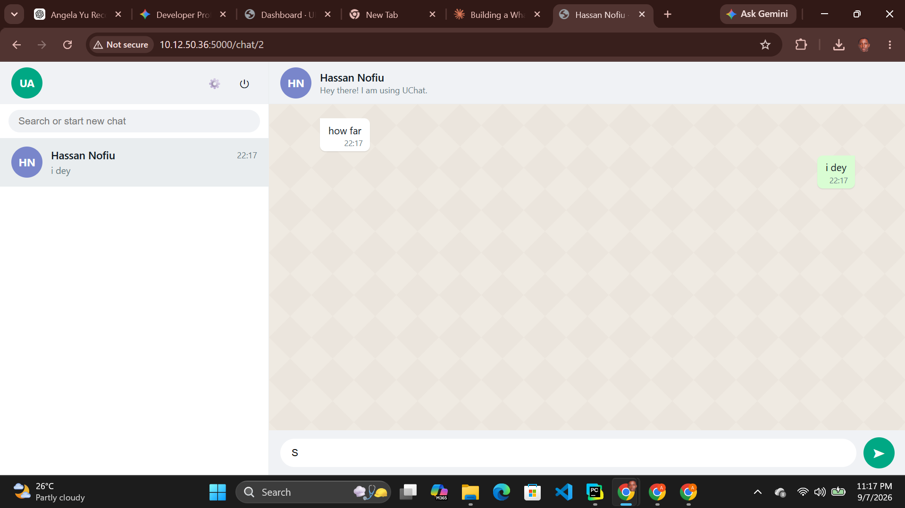

# UChat 💬

**A real-time-feeling chat app, built from scratch — no frameworks doing the heavy lifting.**

UChat is a WhatsApp-inspired messenger where every piece — auth, message storage,
the "live" delivery, the UI — is hand-built with **Python, Flask, Jinja2, and SQLite**.
No chat SDK, no websocket library, no template kit. Just a clean demonstration of how
messaging apps actually work under the hood: hashed auth, a relational message model,
a lightweight polling layer for near-real-time updates, and a pixel-conscious WhatsApp-style
UI built in plain CSS.



## Features
- Email/username + password auth (Flask-Login, hashed passwords)
- WhatsApp-style UI: sidebar with contacts, unread badges, chat bubbles, timestamps
- Real one-to-one messaging, persisted in SQLite
- Live-feeling updates via lightweight polling (no external services / websocket server needed)
- Editable profile (display name + status)
- Fully responsive layout

## Tech stack
- **Backend:** Flask, Flask-SQLAlchemy, Flask-Login
- **Frontend:** Jinja2 templates, vanilla CSS + JS (no framework needed)
- **Database:** SQLite (swap the URI in `app.py` for Postgres/MySQL in production)

## Getting started

```bash
# 1. Create and activate a virtual environment
python -m venv venv
source venv/bin/activate      # Windows: venv\Scripts\activate

# 2. Install dependencies
pip install -r requirements.txt

# 3. Initialize the database
flask --app app init-db

# 4. Run the app
python app.py
```

Visit **http://localhost:5000**, register two or more accounts (e.g. in separate browser
windows / incognito tabs), and start chatting between them.

## Project structure
```
uchat/
├── app.py                  # Routes, models, app factory
├── requirements.txt
├── uchat.db                 # created on first run
├── templates/
│   ├── base.html
│   ├── login.html
│   ├── register.html
│   ├── index.html           # sidebar + chat window
│   └── profile.html
└── static/
    ├── css/style.css
    └── js/app.js
```

## How it works
- **Auth:** `flask_login` manages sessions; passwords are hashed with `werkzeug.security`.
- **Messaging:** Each message is a row in the `Message` table (`sender_id`, `recipient_id`, `body`, `timestamp`, `is_read`).
- **"Real-time" feel:** The chat window polls `/api/messages/<user_id>?since=<last_id>` every 2.5s for new messages, and the sidebar polls `/api/sidebar` every 4s for unread counts and last-message previews — no websocket infrastructure required, easy to deploy anywhere.
- **Read receipts (basic):** messages are marked read when the recipient opens/polls the conversation.

## Ideas to extend this for your portfolio
- Swap polling for WebSockets (Flask-SocketIO) for true real-time delivery
- Add image/file attachments
- Add group chats
- Add online/typing indicators
- Deploy to Render/Railway/Fly.io with Postgres

## Deployment notes
Set a real `UCHAT_SECRET_KEY` environment variable in production, and point
`SQLALCHEMY_DATABASE_URI` at a persistent database rather than SQLite if
deploying somewhere with an ephemeral filesystem.
